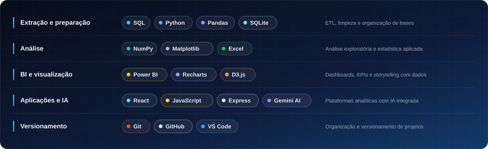

 

### Transformo dados em indicadores confiáveis e decisões de negócio

 

 

## Perfil

Analista de dados com foco em **Business Intelligence**, cursando Ciência de Dados na UNINTER. Desenvolvo projetos de ponta a ponta, cobrindo **extração e tratamento (SQL, Python), análise exploratória, definição de KPIs e construção de dashboards**, sempre com atenção à confiabilidade dos números e à utilidade da informação para quem precisa decidir.

<table>
  <tr>
    <td width="170"><b>🎯 Posição-alvo</b></td>
    <td>Analista de Dados Júnior · Analista de BI Júnior · Estágio em Dados</td>
  </tr>
  <tr>
    <td><b>🧰 Stack principal</b></td>
    <td>SQL · Python · Power BI · Excel</td>
  </tr>
  <tr>
    <td><b>🎓 Formação</b></td>
    <td>Ciência de Dados — UNINTER <i>(cursando)</i></td>
  </tr>
  <tr>
    <td><b>🚀 Em desenvolvimento</b></td>
    <td>Modelagem de dados · Analytics Engineering · Microsoft Fabric · IA aplicada a Analytics</td>
  </tr>
</table>

 

## Competências

 

## Projetos em destaque

### 📊 DSBI — Data & Business Intelligence

Plataforma de BI para explorar, analisar e visualizar dados em um único ambiente, unindo dashboards interativos, indicadores e um assistente com IA.

| | |
|---|---|
| **Entregas** | Dashboards interativos · KPIs e indicadores · Relatórios gerenciais · Análise de tendências · Integração com IA |
| **Stack** | `React` `Express` `SQLite` `Recharts` `D3.js` `Gemini AI` |

<!-- 🔗 Adicione os links: [Repositório](URL) · [Demo](URL) -->

 

### 💰 Dashboard CPGF — Gastos Públicos

Análise de dados abertos de gastos do governo, com foco em transparência, exploração e identificação de padrões.

<table>
  <tr>
    <td align="center" width="50%"><h2>R$ 67 mi</h2>valor analisado</td>
    <td align="center" width="50%"><h2>+122 mil</h2>transações processadas</td>
  </tr>
</table>

| | |
|---|---|
| **Abordagem** | Tratamento e organização da base → construção de indicadores → análise de gastos → identificação de tendências → dashboard interativo |

<!-- 🛠️ Adicione a linha "Stack" com as ferramentas reais usadas no CPGF (ex.: Power BI, Python...) -->
<!-- 🔗 Adicione os links: [Repositório](URL) · [Demo](URL) -->
<!-- 📌 Sugestão: adicione aqui 2 ou 3 achados reais (ex.: categoria de maior gasto, sazonalidade, ticket médio) -->

 

### 🐍 Análises em Python

Série de análises cobrindo o ciclo completo, da base bruta ao insight.

`ETL` → `Limpeza` → `Exploração` → `Análise` → `Visualização` → `Insights`

**Ferramentas:** Pandas · NumPy · Matplotlib · estatística aplicada · automação de relatórios

<a href="https://joao-wellyngton-data.netlify.app"><b>Ver todos os projetos no portfólio →</b></a>

 

## Como trabalho

| Princípio | Na prática |
|---|---|
| **Pergunta antes da ferramenta** | Começo pelo problema de negócio e pelo que será decidido com o dado |
| **Qualidade na origem** | Tratamento e validação da base antes de qualquer visualização |
| **KPIs bem definidos** | Cada indicador com fórmula, granularidade e objetivo claros |
| **Visual a serviço da decisão** | Dashboards objetivos, sem excesso, contando uma história |

 

## Formação e certificações

| | | |
|---|---|---|
| 🎓 | **Ciência de Dados** | UNINTER · *em andamento* |
| 📜 | **Power BI** | EmpowerData |
| 📜 | **IA na Prática** | Daxus |
| 📜 | **Full Stack** | Hashtag Programação |

 

---

### Vamos conversar?

Aberto a oportunidades como **Analista de Dados Júnior**, **Analista de BI Júnior** e **Estágio em Dados**.

